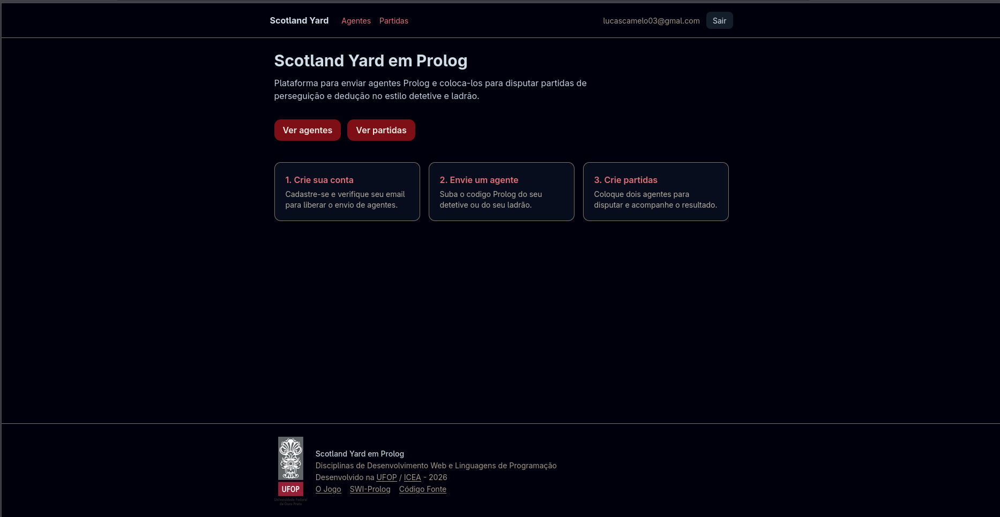
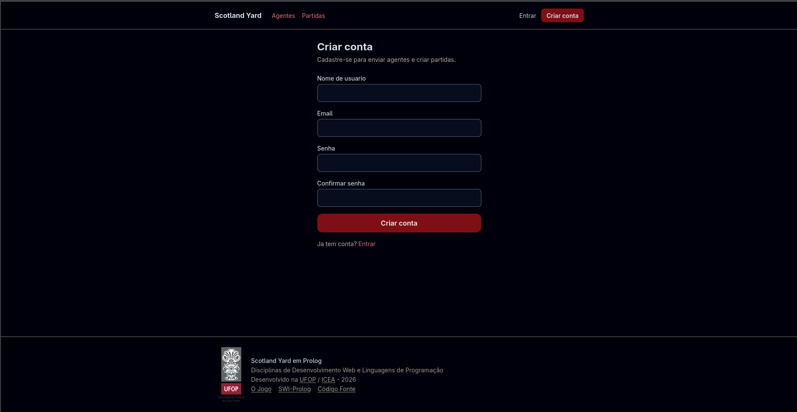
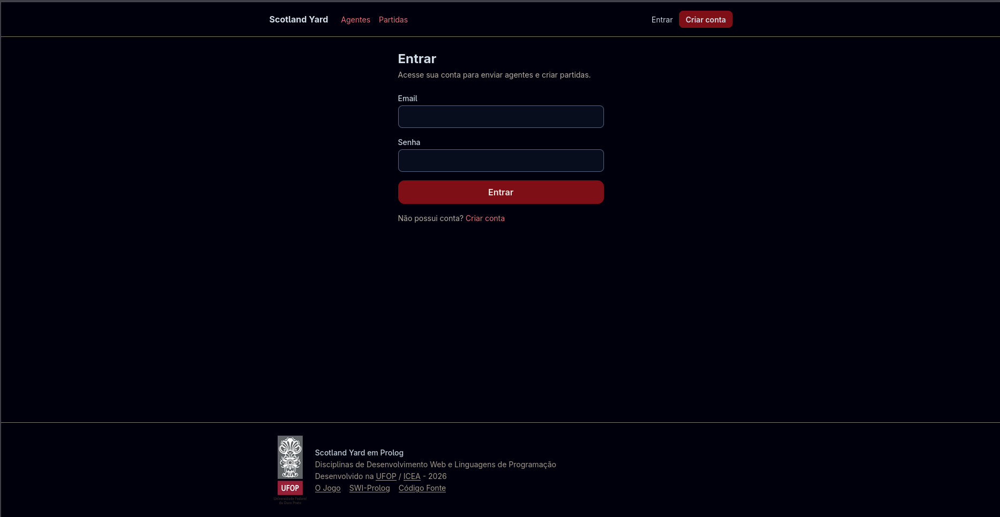
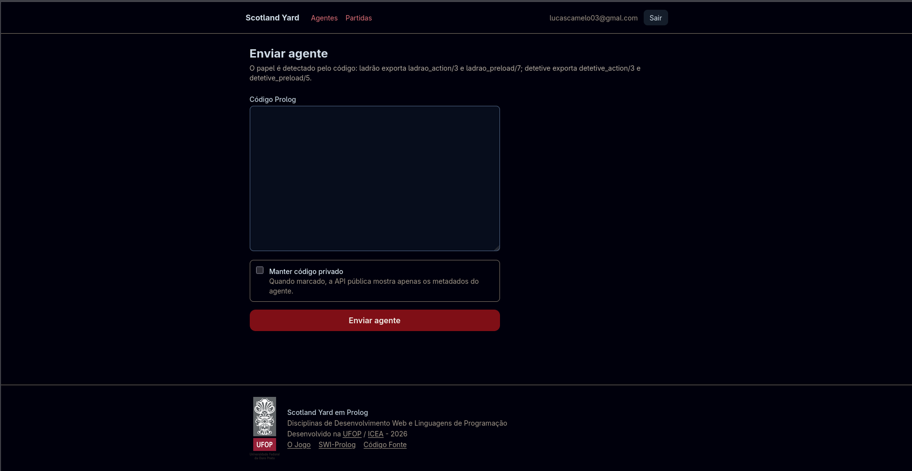
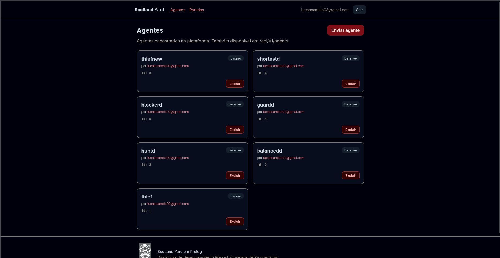
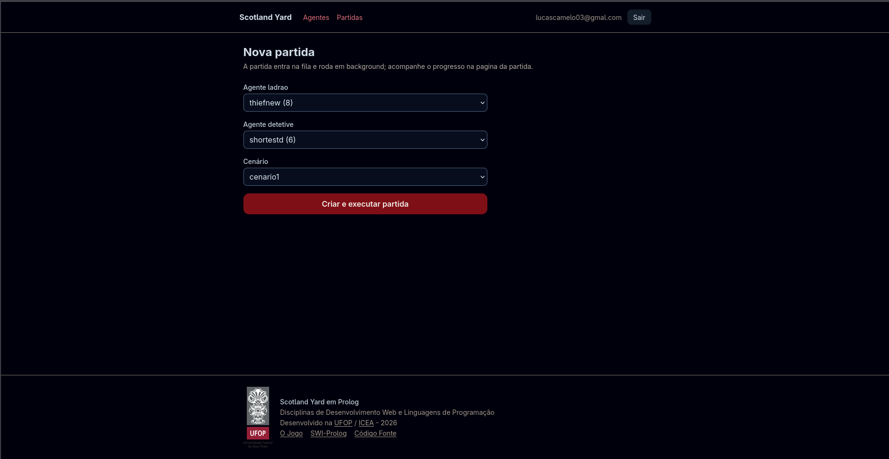
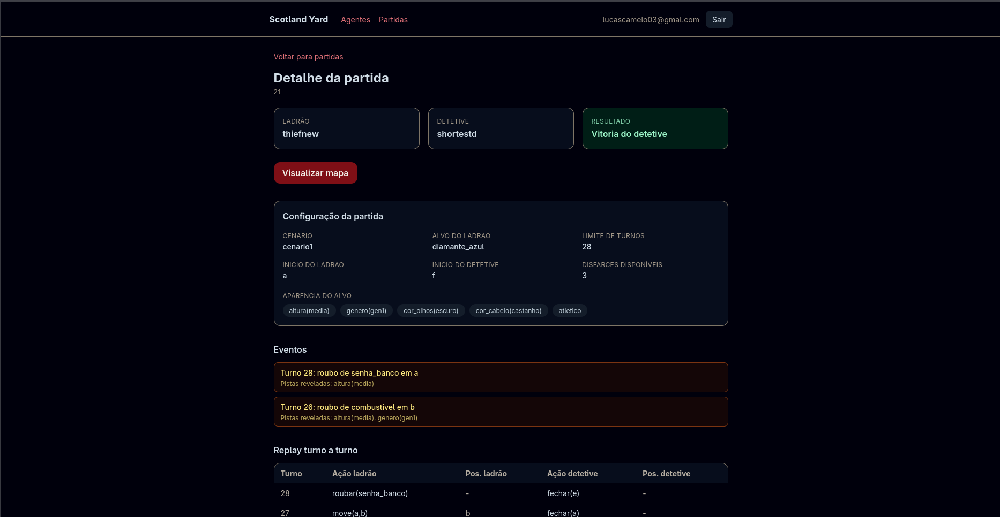
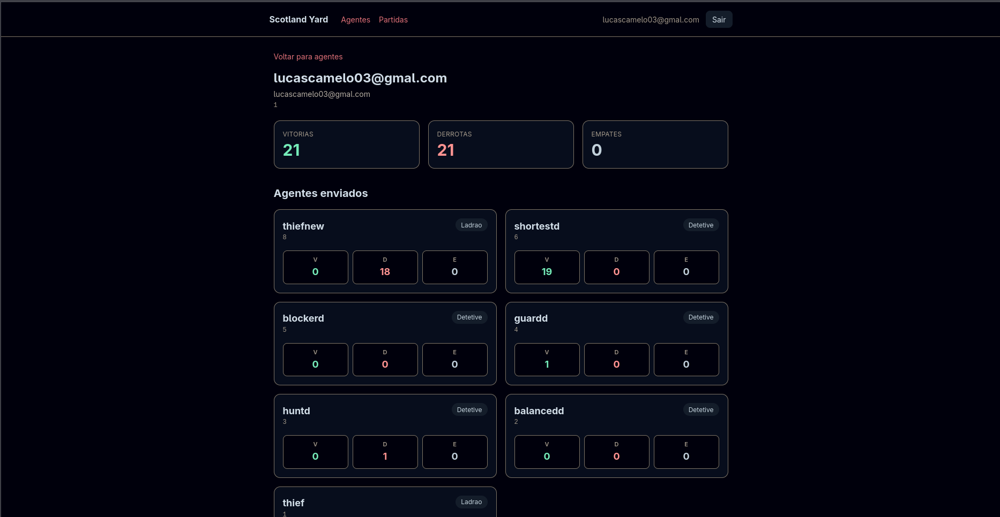

# CSI606-2026-01 - Proposta de Trabalho Final

**Discente:** Lucas dos Anjos Camelo

## Resumo

Este projeto surgiu a partir da disciplina de Linguagens de Programação, na qual estou estudando Prolog e seus principais conceitos, como programação lógica, fatos, regras e inferência. Na disciplina, foi proposto um trabalho envolvendo a criação de agentes capazes de jogar um jogo de turnos inspirado em jogos de perseguição e dedução, como o clássico jogo de tabuleiro Scotland Yard.

Nesse jogo, dois agentes disputam com objetivos opostos: um assume o papel de detetive e o outro o papel de ladrão. O objetivo do ladrão é fugir da cidade sem ser capturado, enquanto o detetive deve usar as informações disponíveis, pistas deixadas ao longo da partida e ações estratégicas, como bloquear regiões da cidade, para deduzir a posição do ladrão e capturá-lo antes que ele consiga escapar. A ideia inicial da atividade seria que progamássemos esses agentes para executá-los localmente na máquina do professor, mas decidi expandir a proposta e transformá-la em uma API Web, permitindo cadastrar, enviar e executar agentes Prolog por meio de um servidor.

Dessa forma, o projeto une o conteúdo estudado em Linguagens de Programação com os conceitos da disciplina de Desenvolvimento Web, criando uma aplicação completa com backend, rotas HTTP, persistência em banco de dados, autenticação, upload de código e execução controlada das partidas. A proposta final é desenvolver uma plataforma em que usuários possam submeter seus próprios agentes, iniciar partidas entre eles e acompanhar os resultados, tornando o jogo mais acessível, reutilizável e próximo de uma aplicação real.

O [motor do jogo](src/engine/Interactor.prolog) utilizado foi disponibilizado pelo professor [Elton Maximo Cardoso](src/engine/README.md), do DECSI/ICEA/UFOP.

Instruções para execução do servidor estão disponíveis em [src/README.md](src/README.md).

https://youtu.be/t8u9XmyGOkw

## 1. Tema

Aplicação Web para execução de partidas entre agentes inteligentes programados em Prolog.

A aplicação permitirá que usuários submetam agentes capazes de jogar uma partida de turnos no estilo “detetive e ladrão”. O sistema será responsável por armazenar os agentes enviados, criar partidas entre eles, executar a lógica do jogo e disponibilizar os resultados por meio de uma interface Web e de uma API HTTP.

## 2. Escopo

Este projeto terá as seguintes funcionalidades:

- Cadastro e autenticação de usuários.
- Verificação de e-mail para liberação do envio de agentes.
- Upload de agentes escritos em Prolog.
- Validação mínima do código enviado, bloqueando predicados e diretivas perigosas.
- Listagem dos agentes cadastrados.
- Criação de partidas entre dois agentes, sendo um no papel de ladrão e outro no papel de detetive.
- Execução de partidas em turnos, com limite de tempo e inferências para cada agente.
- Registro dos resultados das partidas.
- Consulta de partidas e seus resultados.
- Interface Web simples servida pelo próprio servidor Prolog, utilizando uma DSL HTML e Tailwind via CDN.
- Persistência dos dados em SQLite.

## 3. Restrições

Neste trabalho não serão considerados:

- Execução distribuída dos agentes em múltiplos servidores.
- Sistema avançado de ranking ou matchmaking automático.
- Interface gráfica complexa para visualização animada das partidas.
- Execução dos agentes em containers ou processos completamente isolados.
- Envio assíncrono de e-mails por fila.
- Deploy final em ambiente de produção com domínio próprio e HTTPS obrigatório.
- Estratégia de Backup do Banco de Dados.

## 4. Protótipo

A princípio, a aplicação deverá conter as seguintes páginas:

- [Página inicial](src/server/routes/web/index.pl), apresentando a ideia do jogo e da plataforma: 
- [Página de cadastro de usuário](src/server/routes/web/signup.pl): 
- [Página de login](src/server/routes/web/login.pl): 
- [Página de envio de agente Prolog](src/server/routes/web/agents_new.pl): 
- [Página de listagem de agentes](src/server/routes/web/agents_list.pl): 
- [Página de criação de partida](src/server/routes/web/matches_new.pl): 
- [Página de listagem de partidas](src/server/routes/web/matches_list.pl): 
- [Página de visualização dos detalhes e resultado de uma partida](src/server/routes/web/matches_show.pl): 
- [Página de perfil do usuário](src/server/routes/web/users_show.pl): 

A interface será simples e funcional, servida pelo próprio backend em SWI-Prolog, utilizando geração de HTML por meio de uma DSL e estilização com Tailwind CSS via CDN.

## 5. Referências

RAVENSBURGER. *Scotland Yard*. Jogo de tabuleiro. Ravensburger, 1983.

WIELEMAKER, Jan et al. *SWI-Prolog*. Disponível em: <https://www.swi-prolog.org/>. Acesso em: 16 maio 2026.

SWI-PROLOG. *HTTP server libraries*. Disponível em: <https://www.swi-prolog.org/pldoc/doc_for?object=section(%27packages/http.html%27)>. Acesso em: 16 maio 2026.

SWI-PROLOG. *Cryptographic password hashes*. Disponível em: <https://www.swi-prolog.org/pldoc/man?section=crypto>. Acesso em: 16 maio 2026.

TAILWIND CSS. *Tailwind CSS Documentation*. Disponível em: <https://tailwindcss.com/docs>. Acesso em: 16 maio 2026.

RESEND. *Resend Documentation*. Disponível em: <https://resend.com/docs>. Acesso em: 16 maio 2026.
