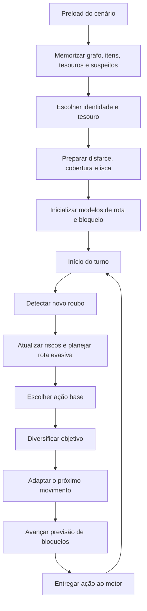

# Arquitetura e estratégia do agente `ladrao_raffles`

Este documento descreve a implementação atual de
[`agents/ladrao_raffles.pl`](../agents/ladrao_raffles.pl). O objetivo do
agente é completar uma cadeia de roubos e fugir sem depender de nomes
específicos de mapas, cidades, objetos ou detetives. Para isso, ele combina
planejamento por dependências, ambiguidade de identidade, disfarces,
objetivos de cobertura, variação de rotas e uma estimativa conservadora das
cidades que podem ser bloqueadas.

## 1. Estratégia geral

O agente trabalha em duas escalas:

- Antes da partida, analisa todo o cenário, escolhe uma identidade difícil
  de deduzir, seleciona um tesouro com cadeia curta e prepara planos de
  disfarce e cobertura.
- Durante a partida, escolhe o próximo objeto necessário, altera a ordem de
  objetivos equivalentes, evita cidades de risco e randomiza decisões
  empatadas para não repetir sempre o mesmo comportamento.

A estratégia não tenta reconhecer qual detetive está jogando. Em vez disso,
mantém hipóteses genéricas sobre comportamentos comuns: bloquear a cidade
do roubo, bloquear um vizinho provável, antecipar o menor caminho ou
proteger o próximo objeto disponível.

O plano pode ser resumido assim:

1. escolher identidade, tesouro e disfarce;
2. preparar uma cadeia de cobertura ou uma isca barata;
3. coletar os requisitos do tesouro;
4. variar objetivos e caminhos sem aumentar demais o custo;
5. evitar bloqueios previstos;
6. roubar o tesouro real;
7. sair por uma aresta pouco previsível.

## 2. Interface com o motor

O módulo exporta somente dois predicados:

```prolog
ladrao_preload/7
ladrao_action/3
```

### 2.1 `ladrao_preload/7`

```prolog
ladrao_preload(
    Grafo,
    Suspeitos,
    Itens,
    Tesouros,
    pronto,
    LadraoID,
    ObjetivoLadrao
).
```

É executado uma vez, antes do primeiro turno. Suas responsabilidades são:

- copiar o cenário para a memória dinâmica;
- transformar cada aresta em duas direções;
- escolher `LadraoID`;
- escolher `ObjetivoLadrao`;
- preparar cobertura, isca e disfarces;
- inicializar as memórias usadas durante a partida.

### 2.2 `ladrao_action/3`

```prolog
ladrao_action(Eventos, Estado, Acao).
```

É executado em todos os turnos. O estado esperado possui a forma:

```prolog
thief(
    loc(Cidade),
    Id,
    aparencia(Atributos),
    TesouroAlvo,
    ItensColetados,
    PontosDeDisfarce
)
```

O argumento `Eventos` não é usado pela estratégia atual. Um novo roubo é
detectado pelo aumento da quantidade de itens no inventário. Essa escolha
reduz o acoplamento com o formato dos eventos do detetive.

## 3. Visão arquitetural



O processamento de um turno é uma sequência de refinamentos:

```text
estado atual
  → atualização da memória
  → ação base
  → diversificação da cadeia
  → adaptação do movimento
  → atualização temporal dos bloqueios
  → ação final
```

Cada etapa tem uma função distinta:

- `preparar_turno/1` atualiza o modelo interno;
- `acao_base/2` decide entre disfarçar, roubar e mover;
- `ajustar_acao_cadeia/3` pode trocar o objetivo imediato;
- `adaptar_movimento/3` escolhe uma aresta menos previsível;
- `avancar_modelo_bloqueios/0` simula a passagem de um turno.

## 4. Memória dinâmica

A memória é dividida por responsabilidade.

### 4.1 Conhecimento estático do cenário

| Predicado | Conteúdo |
|---|---|
| `aresta_conhecida/2` | Arestas do mapa nas duas direções. |
| `item_conhecido/3` | Nome, cidade e requisitos de cada item. |
| `tesouro_conhecido/3` | Nome, cidade e requisitos de cada tesouro. |
| `suspeito_conhecido/1` | Estrutura completa de cada suspeito. |

Esses fatos são carregados no `preload` e permanecem estáveis durante a
partida.

### 4.2 Objetivos secundários

| Predicado | Conteúdo |
|---|---|
| `tesouro_cobertura/1` | Segundo tesouro cuja cadeia será preparada. |
| `cidade_cobertura_perigosa/1` | Cidade final da cobertura, evitada quando a cadeia já está pronta. |
| `itens_isca/1` | Itens pertencentes à cadeia secundária escolhida como isca. |
| `bait_usado/0` | Marca que a única isca permitida já foi roubada ou foi desativada. |
| `escolha_diversificada/3` | Mantém a folha alternativa escolhida para um inventário específico. |

### 4.3 Disfarces

| Predicado | Conteúdo |
|---|---|
| `plano_disfarce_forte/3` | Pontuação, identidade imitada e modificações de um plano. |
| `disfarce_forte_feito/0` | Informa que o plano forte já foi aplicado. |
| `disfarce_inicial_feito/0` | Impede repetir o disfarce simples. |

### 4.4 Movimento

| Predicado | Conteúdo |
|---|---|
| `cidade_anterior/1` | Cidade deixada no movimento anterior. |
| `total_itens_observado/1` | Tamanho do inventário no último turno processado. |
| `rota_evasiva/1` | Passos restantes de uma rota alternativa planejada. |
| `destino_rota_evasiva/1` | Destino para o qual a rota armazenada continua válida. |

### 4.5 Crença sobre bloqueios

| Predicado | Conteúdo |
|---|---|
| `fila_bloqueios_prevista/1` | Sequência de vizinhos que podem ser bloqueados nos próximos turnos. |
| `bloqueio_persistente_previsto/1` | Última cidade prevista quando a fila termina. |
| `cidade_ja_bloqueada_prevista/1` | Histórico das cidades já consumidas pelo modelo. |
| `armadilha_gulosa_prevista/1` | Cidade que um perseguidor guloso provavelmente protegeria. |
| `origem_roubo_recente/1` | Cidade do último roubo detectado. |

`limpar_memoria/0` remove todos esses fatos antes de uma nova partida. Isso
evita que uma execução contamine a seguinte.

## 5. Preparação antes da partida

O `ladrao_preload/7` segue esta ordem:

1. limpa qualquer memória anterior;
2. memoriza o grafo como não direcionado;
3. memoriza itens, tesouros e suspeitos;
4. escolhe a identidade;
5. escolhe o tesouro real;
6. escolhe um possível tesouro de cobertura;
7. gera planos de disfarce forte;
8. configura a isca;
9. inicializa inventário observado, rota e fila de bloqueios;
10. estima a primeira armadilha gulosa.

A ordem é importante. Por exemplo, a isca só é ativada quando nenhuma
cobertura completa foi selecionada.

## 6. Escolha da identidade

O agente prefere uma identidade cujas pistas iniciais também sejam
compatíveis com vários outros suspeitos.

Para cada suspeito, `pontuacao_ambiguidade/3` avalia todos os prefixos de sua
aparência:

```text
primeiro atributo
primeiros dois atributos
primeiros três atributos
...
```

Em cada prefixo, conta quantos suspeitos continuam compatíveis. A
pontuação da identidade é:

```text
pontuação = Σ quantidade_de_ids_compatíveis(prefixo) × peso(posição)
```

Os pesos atuais são:

| Posição | Peso |
|---:|---:|
| 1 | 10000 |
| 2 | 3000 |
| 3 | 1000 |
| 4 | 300 |
| 5 em diante | 100 |

Isso dá muito mais importância às primeiras pistas, pois elas aparecem
quando o detetive ainda está formando sua hipótese. Em caso de empate entre
as identidades mais bem pontuadas, a escolha é aleatória.

## 7. Estratégia de disfarce

### 7.1 Disfarce forte

O agente compara a aparência real com a de todos os outros suspeitos. Para
cada identidade alternativa, gera planos que tentam imitar prefixos de
tamanhos diferentes.

Ao comparar dois atributos:

- se são iguais, nenhuma modificação é necessária;
- se possuem o mesmo tipo e aridade, usa `trocar(Original, Falso)`;
- caso contrário, usa `omitir(Original)`.

Somente planos com duas ou mais modificações são cadastrados como fortes.
Cada aparência simulada é avaliada antes da partida.

A pontuação de um plano forte é:

```text
pontuação =
    pontuação_da_aparência
    + tamanho_do_prefixo × 1000
    - custo_do_plano × 30
    - quantidade_de_omissões × 250
```

Assim, o agente prefere imitar prefixos maiores, mas penaliza planos caros
e omissões.

### 7.2 Pontuação da aparência simulada

Para cada um dos cinco primeiros prefixos, o agente calcula quais IDs ainda
seriam compatíveis:

| Situação após observar o prefixo | Valor base |
|---|---:|
| Nenhum suspeito compatível | 80 |
| O ID real não está entre os compatíveis | 70 |
| Mais de dois suspeitos compatíveis | `40 + quantidade` |
| Somente um suspeito compatível | -80 |
| Exatamente dois suspeitos compatíveis | -40 |

O valor base é multiplicado pelo peso da posição. Portanto, uma alteração
que confunde já na primeira pista vale muito mais que uma alteração útil
somente na quinta.

### 7.3 Disfarce simples

Se nenhum plano forte couber nos pontos disponíveis, o agente usa um
fallback de uma modificação:

1. considera somente os três primeiros atributos;
2. procura valores alternativos do mesmo tipo presentes em outros
   suspeitos;
3. simula cada troca;
4. escolhe a troca de maior ambiguidade;
5. se nenhuma troca for válida, omite o primeiro atributo.

O disfarce é aplicado antes do primeiro roubo, para que as primeiras pistas
já sejam falsas ou ambíguas.

## 8. Escolha do tesouro

Um tesouro só é elegível quando sua cadeia é resolvível. A validação
recursiva exige que:

- cada requisito exista como item;
- os sub-requisitos também sejam resolvíveis;
- não exista ciclo na cadeia atual.

Para cada tesouro válido, o agente expande todos os requisitos diretos e
indiretos, remove duplicatas e conta o total. O objetivo real é escolhido
entre os tesouros de menor quantidade de requisitos.

Essa métrica favorece menos roubos e, consequentemente:

- menos turnos gastos;
- menos eventos revelados;
- menos atributos da aparência expostos;
- menor tempo para o detetive bloquear o mapa.

Empates são resolvidos aleatoriamente para evitar que o agente sempre
escolha o mesmo objetivo em cenários equivalentes.

## 9. Tesouro de cobertura

Depois de escolher o tesouro real, o agente procura um segundo tesouro cuja
cadeia possa ser preparada com baixo custo adicional.

Para cada candidato são calculados:

```text
itens_reais       = requisitos recursivos do tesouro real
itens_cobertura   = requisitos recursivos do segundo tesouro
adicionais        = itens_cobertura - itens_reais
união             = itens_reais ∪ itens_cobertura
```

A cobertura é aceita quando pelo menos uma condição é satisfeita:

```text
quantidade(adicionais) ≤ quantidade(itens_reais)
```

ou:

```text
quantidade(união) × 3 ≤ quantidade_de_cidades
```

Entre as coberturas válidas, minimiza primeiro a quantidade de itens
adicionais e depois o tamanho da união. Empates são randomizados.

O agente coleta os requisitos da cobertura, mas não rouba seu tesouro. Ao
deixar a cadeia secundária pronta, volta para a cadeia real. Isso faz com
que o histórico de roubos seja compatível com mais de um objetivo final.

A cidade do tesouro de cobertura passa a ser considerada perigosa quando
todos os requisitos dela estão prontos. O agente evita entrar nessa cidade,
pois ela é um bloqueio natural para um detetive que inferiu a cobertura.

## 10. Estratégia de isca

A isca é um fallback usado somente quando não existe uma cobertura completa
viável.

O agente escolhe outro tesouro de cadeia mínima e guarda seus requisitos em
`itens_isca/1`. No máximo um item dessa cadeia pode ser roubado.

Uma isca só é considerada quando:

- ainda não foi usada;
- os requisitos finais do tesouro real ainda não estão todos prontos;
- o item não pertence à cadeia do objetivo real;
- o item está disponível para roubo;
- o desvio espacial é pequeno.

O desvio é calculado por:

```text
D1 = distância(cidade atual, cidade da isca)
D2 = distância(cidade da isca, próximo objetivo real)
Direto = distância(cidade atual, próximo objetivo real)

desvio = D1 + D2 - Direto
```

A isca só é ativada quando:

```text
desvio ≤ 2
```

Assim, ela acrescenta uma pista falsa sem transformar a partida em uma
longa excursão.

## 11. Resolução da cadeia de requisitos

`proximo_objetivo/3` determina o próximo objeto necessário:

1. decide se a cadeia planejada atual é a cobertura ou o tesouro real;
2. encontra o primeiro requisito ainda ausente;
3. desce recursivamente pelos sub-requisitos;
4. retorna a primeira folha pendente;
5. quando todos os requisitos estão prontos, retorna o próprio tesouro
   real.

Exemplo conceitual:

```text
tesouro
├── chave
│   └── mini_chave
└── código
```

Sem nenhum item, o próximo objetivo é `mini_chave`. Depois dela, passa a
ser `chave`; depois `código`; por fim, o próprio `tesouro`.

## 12. Diversificação do próximo objetivo

Seguir sempre o primeiro requisito da lista torna a rota previsível. Por
isso, o agente procura outras folhas pendentes que estejam prontas.

Uma folha alternativa é elegível quando:

- pertence à cadeia planejada;
- é diferente da folha canônica;
- está em cidade diferente;
- sua distância não é maior que a distância até a folha canônica.

Entre as alternativas, escolhe uma das cidades de menor distância. A
escolha é armazenada usando:

```prolog
escolha_diversificada(Tesouro, InventarioOrdenado, Cidade)
```

Enquanto o inventário não muda, o agente mantém a mesma cidade. Isso evita
que a randomização cause zigue-zague a cada turno.

Se o desvio anterior já colocou o ladrão na cidade de outra folha pronta,
`acao_cadeia_real/5` rouba essa folha imediatamente.

## 13. Pipeline de decisão por turno

### 13.1 Atualização da memória

`preparar_turno/1` compara o tamanho do inventário atual com
`total_itens_observado/1`. Quando o total aumenta:

1. registra o novo tamanho;
2. verifica se a cobertura já ficou pronta;
3. atualiza as hipóteses de bloqueio;
4. planeja uma rota diferente do menor caminho previsível.

### 13.2 Prioridade da ação base

`acao_base/2` usa a ordem das cláusulas como uma lista de prioridades:

| Prioridade | Ação | Condição principal |
|---:|---|---|
| 1 | Disfarce forte | Inventário vazio e plano aplicável. |
| 2 | Movimento de fuga | Tesouro real já está no inventário. |
| 3 | Disfarce simples | Nenhum disfarce foi aplicado e ainda há pontos. |
| 4 | Roubar tesouro real | Está na cidade correta e os requisitos estão prontos. |
| 5 | Roubar item de isca | Isca disponível na cidade atual. |
| 6 | Mover até a isca | Isca ativa com desvio aceitável. |
| 7 | Roubar folha da cadeia | Próximo item está disponível na cidade atual. |
| 8 | Mover até o próximo objeto | Ainda falta alcançar o objetivo imediato. |
| 9 | `nada` | Fallback quando nenhuma regra anterior produz ação. |

Os cortes de Prolog encerram a busca quando uma regra prioritária produz
uma ação válida.

### 13.3 Refinamento da ação

Depois da decisão base:

- `ajustar_acao_cadeia/3` pode trocar o objetivo imediato;
- `adaptar_movimento/3` pode trocar apenas a próxima cidade;
- ações de roubo e disfarce permanecem inalteradas.

## 14. Modelo genérico de bloqueios

O agente não sabe qual política o detetive utiliza. Em vez de identificar o
adversário, combina quatro fontes de risco.

### 14.1 Cidade do roubo recente

`origem_roubo_recente/1` guarda a cidade onde o inventário aumentou. Essa
cidade é evitada nos movimentos seguintes porque detetives reativos podem
bloqueá-la.

### 14.2 Fila dos vizinhos

Após um roubo, os vizinhos da cidade são ordenados por grau decrescente.
Isso ocorre porque a chave usada é `-Grau`: no `keysort/2`, o vizinho de
maior grau aparece primeiro.

Vizinhos já consumidos pelo modelo não entram novamente na fila. A cada
turno:

1. o primeiro vizinho é tratado como o próximo bloqueio;
2. ele é removido da fila;
3. entra em `cidade_ja_bloqueada_prevista/1`;
4. quando a fila termina, o último bloqueio torna-se persistente.

Esse comportamento aproxima políticas que bloqueiam sucessivamente cidades
ao redor de um roubo.

### 14.3 Armadilha gulosa

O agente também estima qual objeto um perseguidor guloso consideraria mais
atraente.

No início, a pontuação de um objeto disponível é:

```text
dependências_restantes × 10 - grau_da_cidade
```

Depois de um roubo, a pontuação é:

```text
tamanho_do_caminho × 10 + dependências_restantes × 4
```

Como a lista é ordenada em ordem crescente, o modelo prefere objetos
próximos, com menos dependências restantes e, no primeiro cálculo, cidades
de maior grau.

A armadilha prevista é:

- a própria cidade, quando o objeto já está nela;
- o primeiro passo do menor caminho até o objeto, caso contrário.

### 14.4 Cidade final da cobertura

Quando todos os requisitos da cobertura já foram coletados, a cidade desse
tesouro é adicionada ao conjunto de risco. Ela representa um destino
plausível que o detetive pode proteger.

### 14.5 Conjunto final de cidades evitadas

`cidade_a_evitar/1` reúne:

```text
cidade da cobertura pronta
∪ próximo bloqueio da fila
∪ armadilha gulosa
∪ cidade do roubo recente
```

Antes de buscar uma rota, o agente:

- remove a cidade atual do conjunto, pois precisa poder sair dela;
- não aplica a evasão se o destino estiver marcado como perigoso;
- executa uma BFS que ignora as demais cidades do conjunto.

Se não existir caminho seguro, o pipeline continua para os fallbacks de
rota em vez de ficar sem ação.

## 15. Rotas evasivas após cada roubo

Além do conjunto de riscos, o agente tenta evitar o começo do menor caminho
canônico que um detetive poderia prever.

O processo é:

1. calcula a rota BFS mínima;
2. extrai os vértices internos;
3. tenta bloquear os três primeiros vértices internos;
4. se necessário, tenta bloquear dois;
5. por último, tenta bloquear apenas um;
6. aceita somente uma rota diferente da original e dentro da folga.

Os limites atuais são:

| Prefixo evitado | Folga máxima |
|---:|---:|
| Até 3 vértices | 3 passos |
| Até 2 vértices | 2 passos |
| Até 1 vértice | 1 passo |

A rota é salva em `rota_evasiva/1`, junto de seu destino. Ela só é
consumida quando:

- o destino estratégico continua igual;
- o próximo passo armazenado ainda é uma aresta válida.

Se o objetivo mudar ou a rota deixar de ser utilizável, outros fallbacks
assumem a decisão.

## 16. Prioridade para escolher o próximo passo

Para um deslocamento normal, `escolher_passo_para_destino/4` segue:

| Prioridade | Estratégia |
|---:|---|
| 1 | Encontrar caminho que evite todas as cidades de risco. |
| 2 | Consumir o próximo passo da rota evasiva planejada. |
| 3 | Escolher outro primeiro passo de distância mínima. |
| 4 | Usar o passo canônico calculado pela ação base. |

Na terceira prioridade, o agente considera quatro níveis:

1. não usar o passo canônico e não retornar;
2. não usar o passo canônico;
3. não retornar;
4. aceitar qualquer vizinho que reduza a distância.

Em cada nível, os candidatos são ordenados, deduplicados e um deles é
escolhido aleatoriamente.

## 17. Fuga depois do tesouro

Assim que o tesouro real entra no inventário, a coleta termina. O agente
precisa sair da cidade final.

A escolha da aresta de fuga usa esta prioridade:

1. diferente da aresta canônica, sem retorno e chegando a uma cidade de
   grau maior que 1;
2. diferente da aresta canônica e sem retorno;
3. sem retorno e chegando a uma cidade de grau maior que 1;
4. qualquer vizinho.

Evitar cidades-folha não é necessário para vencer imediatamente, mas reduz
a previsibilidade e mantém uma saída estruturalmente mais segura caso o
motor ainda precise processar outra etapa.

## 18. Algoritmos de caminho

O agente possui três usos de BFS:

### 18.1 `caminho_mais_curto/3`

Retorna um caminho mínimo em grafo não ponderado. É usado para:

- mover até itens e tesouros;
- prever o próximo passo de um perseguidor guloso;
- construir a rota canônica que será evitada.

### 18.2 `distancia_bfs/3`

Retorna somente a distância. É usado para:

- comparar folhas alternativas;
- limitar o custo da isca;
- encontrar primeiros passos que preservam a distância mínima.

### 18.3 `caminho_evasivo/4`

Executa BFS ignorando cidades bloqueadas. Os vizinhos são embaralhados
antes da expansão, permitindo rotas mínimas diferentes entre partidas.

Em um grafo com `V` cidades e `E` arestas, cada BFS isolada possui custo
assintótico aproximado de `O(V + E)`. O agente executa várias BFS para
comparar candidatos, portanto mapas muito grandes e com muitos objetivos
podem aumentar o custo total do turno.

## 19. Uso controlado de aleatoriedade

O agente randomiza apenas decisões consideradas equivalentes ou próximas:

- identidades empatadas;
- tesouros de mesmo custo;
- coberturas com mesmo custo;
- planos de disfarce com mesma pontuação;
- folhas alternativas de mesma distância;
- caminhos evasivos mínimos;
- arestas de fuga que atendem à mesma prioridade.

Decisões que precisam permanecer estáveis são memorizadas. O principal
exemplo é `escolha_diversificada/3`, que impede trocar de destino enquanto
o inventário não mudar.

Essa combinação produz variedade entre seeds sem transformar cada turno em
uma decisão incoerente.

## 20. Fallbacks e robustez

O agente possui fallbacks em todas as camadas principais:

- sem cobertura, tenta uma isca;
- sem plano de disfarce forte, tenta uma modificação simples;
- sem folha alternativa, segue a folha canônica;
- sem caminho que evite riscos, tenta a rota evasiva armazenada;
- sem rota armazenada, tenta outro caminho mínimo;
- sem caminho alternativo, usa o passo canônico;
- sem ação válida, retorna `nada`.

Esses fallbacks são importantes para o mapa desconhecido: uma heurística
pode não se aplicar, mas a estratégia básica de resolver requisitos e usar
BFS continua disponível.

## 21. O que torna o agente genérico

Não existem regras condicionadas a:

- nome do mapa;
- nome de cidade;
- nome de item ou tesouro;
- ID específico de suspeito;
- nome ou arquivo do detetive adversário.

As decisões usam somente propriedades estruturais:

- quantidade e dependência dos requisitos;
- distâncias no grafo;
- grau das cidades;
- compatibilidade entre aparências;
- custo adicional de uma cobertura;
- mudança do inventário;
- rotas alternativas disponíveis.

Por isso, o agente pode ser testado nos mapas conhecidos sem ser
hardcoded para nenhum deles.

## 22. Limitações conhecidas

Apesar de genérico, o agente faz algumas aproximações:

- não observa diretamente a posição nem as ações do detetive;
- interpreta o aumento do inventário como sinal de novo roubo;
- a escolha inicial do tesouro minimiza roubos, mas não calcula o custo
  espacial completo da cadeia;
- o modelo de bloqueios representa famílias de políticas, não o estado
  real das cidades fechadas;
- a cobertura pode aumentar o número de roubos e, portanto, revelar mais
  atributos;
- múltiplas BFS por turno podem ser caras em mapas muito grandes;
- a randomização ajuda contra previsibilidade, mas resultados individuais
  ainda variam conforme a seed.

Essas limitações são deliberadas: o agente prefere heurísticas simples e
portáveis a uma política especializada em um mapa ou detetive.

## 23. Mapa dos principais predicados

| Área | Predicados principais |
|---|---|
| Interface | `ladrao_preload/7`, `ladrao_action/3` |
| Atualização do turno | `preparar_turno/1`, `processar_novo_roubo/5` |
| Decisão base | `acao_base/2` |
| Dependências | `proximo_objetivo/3`, `resolver_requisito/3`, `requisito_pendente/3` |
| Diversificação | `ajustar_acao_cadeia/3`, `destino_diversificado/4` |
| Identidade | `escolher_identidade/2`, `pontuacao_ambiguidade/3` |
| Disfarce | `preparar_planos_disfarce_forte/2`, `melhor_plano_disfarce_forte/3` |
| Tesouro e cobertura | `escolher_tesouro/1`, `configurar_tesouro_cobertura/2` |
| Isca | `configurar_bait_strategy/1`, `cidade_isca_ativa/4` |
| Movimento | `adaptar_movimento/3`, `escolher_passo_para_destino/4` |
| Rota evasiva | `planejar_rota_anti_bfs/2`, `caminho_evasivo/4` |
| Bloqueios | `atualizar_modelo_bloqueios/2`, `avancar_modelo_bloqueios/0` |
| Fuga | `escolher_saida_imprevisivel/3` |
| Busca | `caminho_mais_curto/3`, `distancia_bfs/3`, `bfs_evasivo/5` |
| Limpeza | `limpar_memoria/0` |

## 24. Explicação curta para apresentação

Uma forma compacta de apresentar o agente é:

> O `ladrao_raffles` escolhe uma identidade cujas primeiras pistas são
> ambíguas e um tesouro com poucos requisitos. Antes dos roubos, aplica um
> disfarce calculado para confundir o mandato. Durante a coleta, pode
> preparar uma segunda cadeia ou roubar uma isca barata, muda a ordem de
> objetivos equivalentes e evita cidades que diferentes políticas de
> detetive provavelmente bloqueariam. Depois de cada roubo, procura uma
> rota curta diferente do menor caminho óbvio. Ao obter o tesouro, escolhe
> uma saída não canônica e evita retornar pela mesma aresta.

Em uma frase: **o agente mantém o plano curto, mas introduz ambiguidade
suficiente na identidade, nos objetivos e nas rotas para não ser facilmente
antecipado.**
