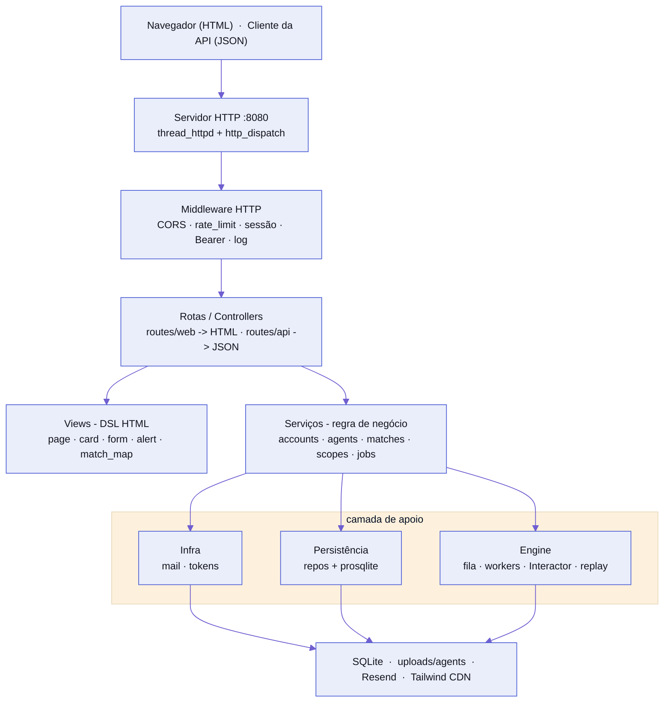

```mermaid
%%{init: {'theme':'base','themeVariables':{'primaryColor':'#eaeefb','primaryTextColor':'#12141c','primaryBorderColor':'#5566d6','lineColor':'#6f5fd0','edgeLabelBackground':'#eaeefb','secondaryColor':'#e4f6ec','tertiaryColor':'#fdf1dd','fontSize':'13px'}}}%%
flowchart TD
    Clients["Navegador (HTML)  ·  Cliente da API (JSON)"]
    HTTP["Servidor HTTP :8080<br/>thread_httpd + http_dispatch"]
    Mid["Middleware HTTP<br/>CORS · rate_limit · sessão · Bearer · log"]
    Routes["Rotas / Controllers<br/>routes/web -> HTML · routes/api -> JSON"]
    Views["Views - DSL HTML<br/>page · card · form · alert · match_map"]
    Serv["Serviços - regra de negócio<br/>accounts · agents · matches · scopes · jobs"]

    subgraph Apoio["camada de apoio"]
        direction LR
        Infra["Infra<br/>mail · tokens"]
        DB["Persistência<br/>repos + prosqlite"]
        Engine["Engine<br/>fila · workers · Interactor · replay"]
    end

    Ext["SQLite  ·  uploads/agents  ·  Resend  ·  Tailwind CDN"]

    Clients --> HTTP --> Mid --> Routes
    Routes --> Views
    Routes --> Serv
    Serv --> Infra
    Serv --> DB
    Serv --> Engine
    Infra --> Ext
    DB --> Ext
    Engine --> Ext
```
