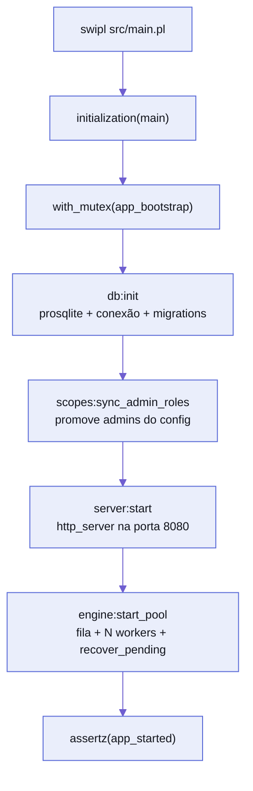

```mermaid
%%{init: {'theme':'base','themeVariables':{'primaryColor':'#eaeefb','primaryTextColor':'#12141c','primaryBorderColor':'#5566d6','lineColor':'#6f5fd0','edgeLabelBackground':'#eaeefb','fontSize':'13px'}}}%%
flowchart TD
    Load["swipl src/main.pl"] --> Init["initialization(main)"]
    Init --> Mutex["with_mutex(app_bootstrap)"]
    Mutex --> A["db:init<br/>prosqlite + conexão + migrations"]
    A --> B["scopes:sync_admin_roles<br/>promove admins do config"]
    B --> C["server:start<br/>http_server na porta 8080"]
    C --> D["engine:start_pool<br/>fila + N workers + recover_pending"]
    D --> E["assertz(app_started)"]
```
