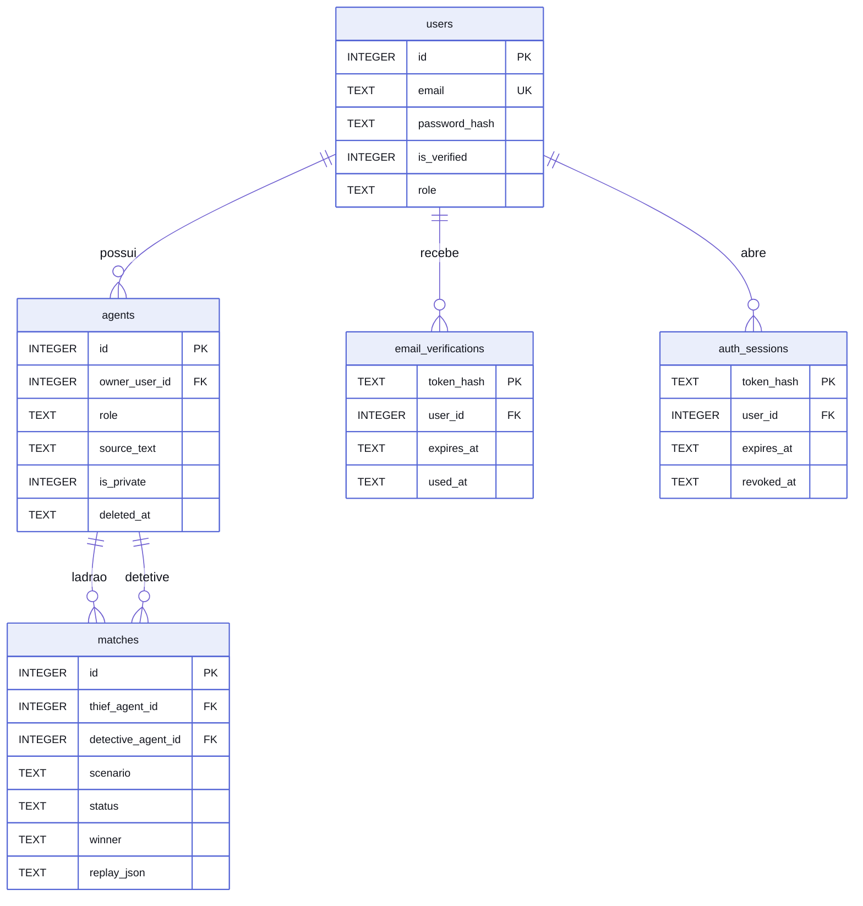

```mermaid
%%{init: {'theme':'base','themeVariables':{'primaryColor':'#eaeefb','primaryTextColor':'#12141c','primaryBorderColor':'#5566d6','lineColor':'#6f5fd0','fontSize':'12px'}}}%%
erDiagram
    users ||--o{ agents : possui
    users ||--o{ email_verifications : recebe
    users ||--o{ auth_sessions : abre
    agents ||--o{ matches : ladrao
    agents ||--o{ matches : detetive

    users {
        INTEGER id PK
        TEXT email UK
        TEXT password_hash
        INTEGER is_verified
        TEXT role
    }
    email_verifications {
        TEXT token_hash PK
        INTEGER user_id FK
        TEXT expires_at
        TEXT used_at
    }
    auth_sessions {
        TEXT token_hash PK
        INTEGER user_id FK
        TEXT expires_at
        TEXT revoked_at
    }
    agents {
        INTEGER id PK
        INTEGER owner_user_id FK
        TEXT role
        TEXT source_text
        INTEGER is_private
        TEXT deleted_at
    }
    matches {
        INTEGER id PK
        INTEGER thief_agent_id FK
        INTEGER detective_agent_id FK
        TEXT scenario
        TEXT status
        TEXT winner
        TEXT replay_json
    }
```
