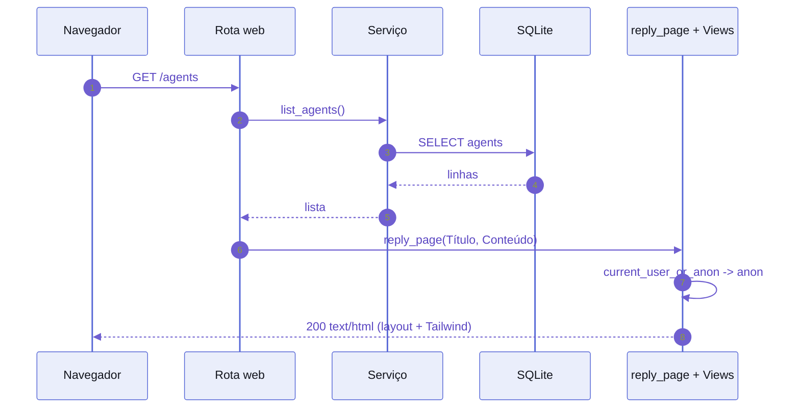

```mermaid
%%{init: {'theme':'base','themeVariables':{'primaryColor':'#eaeefb','primaryTextColor':'#12141c','primaryBorderColor':'#5566d6','lineColor':'#6f5fd0','signalColor':'#6f5fd0','signalTextColor':'#5a46c2','actorTextColor':'#12141c','noteBkgColor':'#fdf1dd','noteTextColor':'#12141c','fontSize':'13px'}}}%%
sequenceDiagram
    autonumber
    participant B as Navegador
    participant R as Rota web
    participant S as Serviço
    participant DB as SQLite
    participant P as reply_page + Views

    B->>R: GET /agents
    R->>S: list_agents()
    S->>DB: SELECT agents
    DB-->>S: linhas
    S-->>R: lista
    R->>P: reply_page(Título, Conteúdo)
    P->>P: current_user_or_anon -> anon
    P-->>B: 200 text/html (layout + Tailwind)
```
