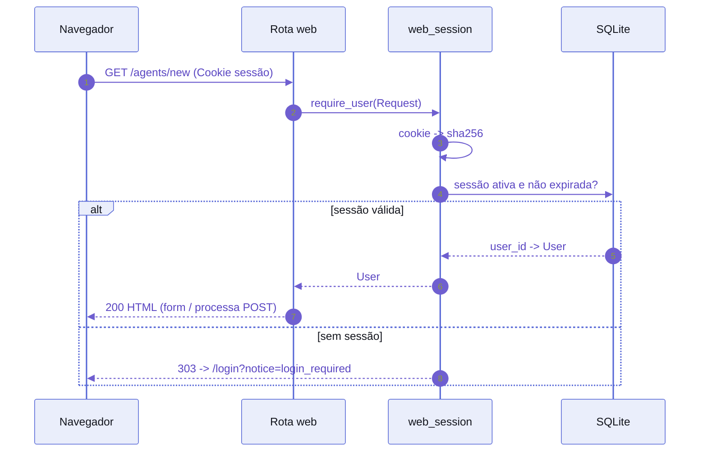

```mermaid
%%{init: {'theme':'base','themeVariables':{'primaryColor':'#eaeefb','primaryTextColor':'#12141c','primaryBorderColor':'#5566d6','lineColor':'#6f5fd0','signalColor':'#6f5fd0','signalTextColor':'#5a46c2','actorTextColor':'#12141c','fontSize':'13px'}}}%%
sequenceDiagram
    autonumber
    participant B as Navegador
    participant R as Rota web
    participant WS as web_session
    participant DB as SQLite

    B->>R: GET /agents/new  (Cookie sessão)
    R->>WS: require_user(Request)
    WS->>WS: cookie -> sha256
    WS->>DB: sessão ativa e não expirada?
    alt sessão válida
        DB-->>WS: user_id -> User
        WS-->>R: User
        R-->>B: 200 HTML (form / processa POST)
    else sem sessão
        WS-->>B: 303 -> /login?notice=login_required
    end
```
