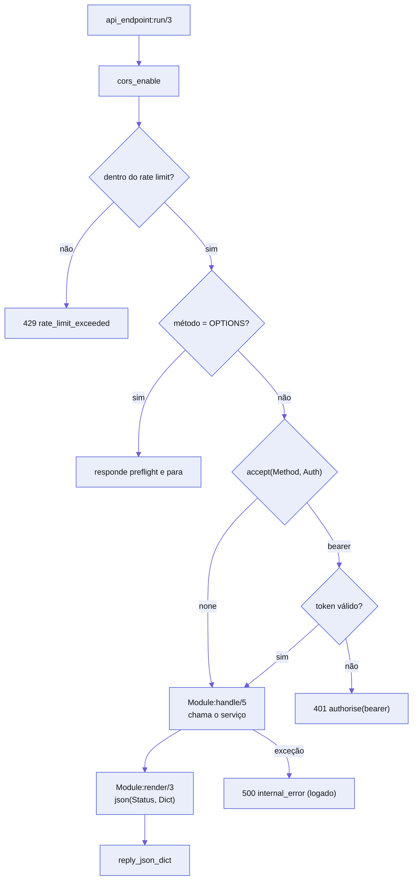

```mermaid
%%{init: {'theme':'base','themeVariables':{'primaryColor':'#eaeefb','primaryTextColor':'#12141c','primaryBorderColor':'#5566d6','lineColor':'#6f5fd0','edgeLabelBackground':'#eaeefb','fontSize':'13px'}}}%%
flowchart TD
    Start["api_endpoint:run/3"] --> CORS["cors_enable"]
    CORS --> RL{"dentro do rate limit?"}
    RL -- não --> E429["429 rate_limit_exceeded"]
    RL -- sim --> OPT{"método = OPTIONS?"}
    OPT -- sim --> Pre["responde preflight e para"]
    OPT -- não --> AUTH{"accept(Method, Auth)"}
    AUTH -- none --> Handle["Module:handle/5<br/>chama o serviço"]
    AUTH -- bearer --> BT{"token válido?"}
    BT -- não --> E401["401 authorise(bearer)"]
    BT -- sim --> Handle
    Handle --> Render["Module:render/3<br/>json(Status, Dict)"]
    Render --> Send["reply_json_dict"]
    Handle -- exceção --> E500["500 internal_error (logado)"]
```
