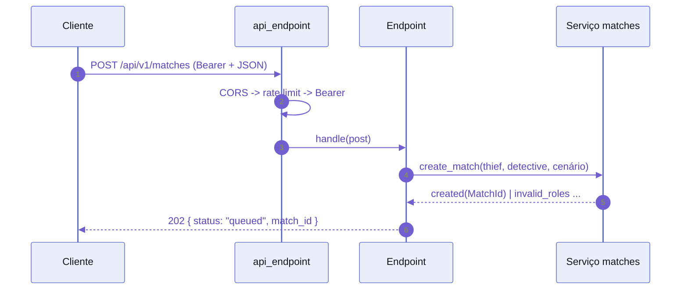

```mermaid
%%{init: {'theme':'base','themeVariables':{'primaryColor':'#eaeefb','primaryTextColor':'#12141c','primaryBorderColor':'#5566d6','lineColor':'#6f5fd0','signalColor':'#6f5fd0','signalTextColor':'#5a46c2','actorTextColor':'#12141c','fontSize':'13px'}}}%%
sequenceDiagram
    autonumber
    participant C as Cliente
    participant AE as api_endpoint
    participant M as Endpoint
    participant S as Serviço matches

    C->>AE: POST /api/v1/matches (Bearer + JSON)
    AE->>AE: CORS -> rate limit -> Bearer
    AE->>M: handle(post)
    M->>S: create_match(thief, detective, cenário)
    S-->>M: created(MatchId) | invalid_roles ...
    M-->>C: 202 { status: "queued", match_id }
```
