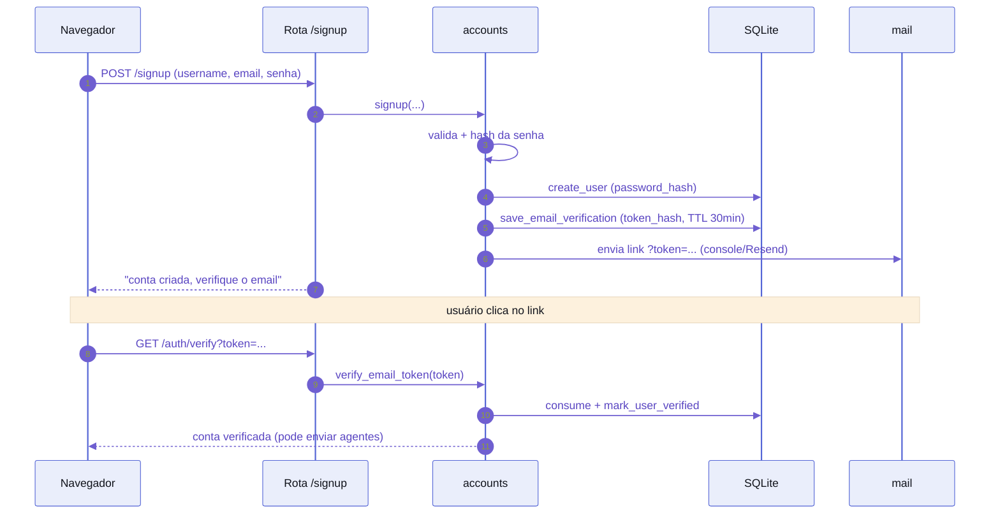

```mermaid
%%{init: {'theme':'base','themeVariables':{'primaryColor':'#eaeefb','primaryTextColor':'#12141c','primaryBorderColor':'#5566d6','lineColor':'#6f5fd0','signalColor':'#6f5fd0','signalTextColor':'#5a46c2','actorTextColor':'#12141c','noteBkgColor':'#fdf1dd','noteTextColor':'#12141c','fontSize':'13px'}}}%%
sequenceDiagram
    autonumber
    participant B as Navegador
    participant R as Rota /signup
    participant AC as accounts
    participant DB as SQLite
    participant ML as mail

    B->>R: POST /signup (username, email, senha)
    R->>AC: signup(...)
    AC->>AC: valida + hash da senha
    AC->>DB: create_user (password_hash)
    AC->>DB: save_email_verification (token_hash, TTL 30min)
    AC->>ML: envia link ?token=... (console/Resend)
    R-->>B: "conta criada, verifique o email"
    Note over B,ML: usuário clica no link
    B->>R: GET /auth/verify?token=...
    R->>AC: verify_email_token(token)
    AC->>DB: consume + mark_user_verified
    AC-->>B: conta verificada (pode enviar agentes)
```
