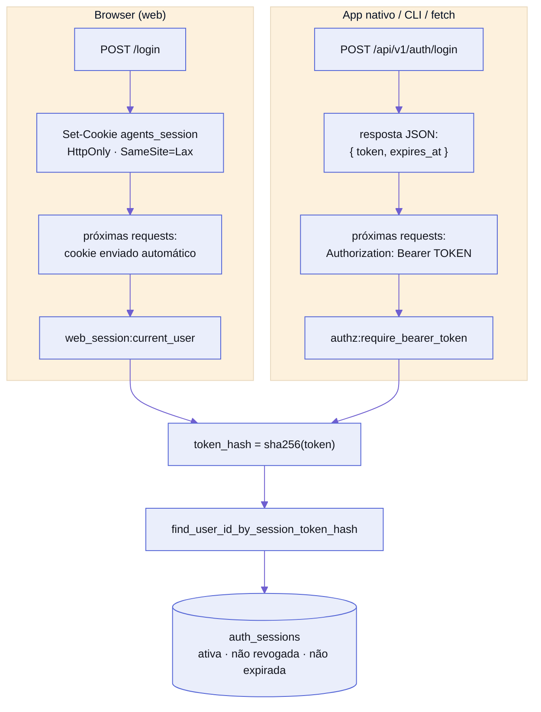

```mermaid
%%{init: {'theme':'base','themeVariables':{'primaryColor':'#eaeefb','primaryTextColor':'#12141c','primaryBorderColor':'#5566d6','lineColor':'#6f5fd0','edgeLabelBackground':'#eaeefb','secondaryColor':'#e4f6ec','tertiaryColor':'#fdf1dd','fontSize':'13px'}}}%%
flowchart TD
    subgraph Web["Browser (web)"]
        WL["POST /login"] --> WC["Set-Cookie agents_session<br/>HttpOnly · SameSite=Lax"]
        WC --> WR["próximas requests:<br/>cookie enviado automático"]
        WR --> WS["web_session:current_user"]
    end

    subgraph Nat["App nativo / CLI / fetch"]
        NL["POST /api/v1/auth/login"] --> NT["resposta JSON:<br/>{ token, expires_at }"]
        NT --> NR["próximas requests:<br/>Authorization: Bearer TOKEN"]
        NR --> NA["authz:require_bearer_token"]
    end

    WS --> H["token_hash = sha256(token)"]
    NA --> H
    H --> F["find_user_id_by_session_token_hash"]
    F --> DB[("auth_sessions<br/>ativa · não revogada · não expirada")]
```
