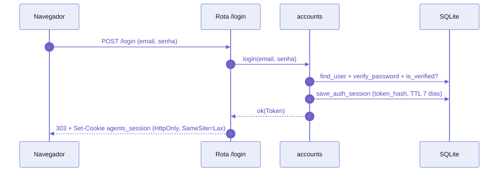

```mermaid
%%{init: {'theme':'base','themeVariables':{'primaryColor':'#eaeefb','primaryTextColor':'#12141c','primaryBorderColor':'#5566d6','lineColor':'#6f5fd0','signalColor':'#6f5fd0','signalTextColor':'#5a46c2','actorTextColor':'#12141c','fontSize':'13px'}}}%%
sequenceDiagram
    autonumber
    participant B as Navegador
    participant R as Rota /login
    participant AC as accounts
    participant DB as SQLite

    B->>R: POST /login (email, senha)
    R->>AC: login(email, senha)
    AC->>DB: find_user + verify_password + is_verified?
    AC->>DB: save_auth_session (token_hash, TTL 7 dias)
    AC-->>R: ok(Token)
    R-->>B: 303 + Set-Cookie agents_session (HttpOnly, SameSite=Lax)
```
