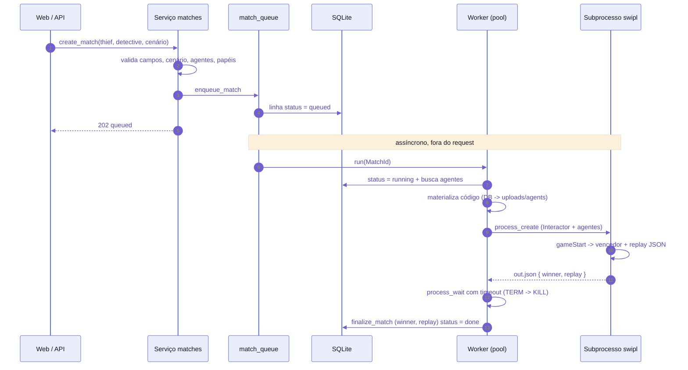

```mermaid
%%{init: {'theme':'base','themeVariables':{'primaryColor':'#eaeefb','primaryTextColor':'#12141c','primaryBorderColor':'#5566d6','lineColor':'#6f5fd0','signalColor':'#6f5fd0','signalTextColor':'#5a46c2','actorTextColor':'#12141c','noteBkgColor':'#fdf1dd','noteTextColor':'#12141c','fontSize':'12px'}}}%%
sequenceDiagram
    autonumber
    participant U as Web / API
    participant S as Serviço matches
    participant Q as match_queue
    participant DB as SQLite
    participant W as Worker (pool)
    participant SP as Subprocesso swipl

    U->>S: create_match(thief, detective, cenário)
    S->>S: valida campos, cenário, agentes, papéis
    S->>Q: enqueue_match
    Q->>DB: linha status = queued
    S-->>U: 202 queued
    Note over Q,SP: assíncrono, fora do request
    Q->>W: run(MatchId)
    W->>DB: status = running + busca agentes
    W->>W: materializa código (DB -> uploads/agents)
    W->>SP: process_create (Interactor + agentes)
    SP->>SP: gameStart -> vencedor + replay JSON
    SP-->>W: out.json { winner, replay }
    W->>W: process_wait com timeout (TERM -> KILL)
    W->>DB: finalize_match (winner, replay) status = done
```
