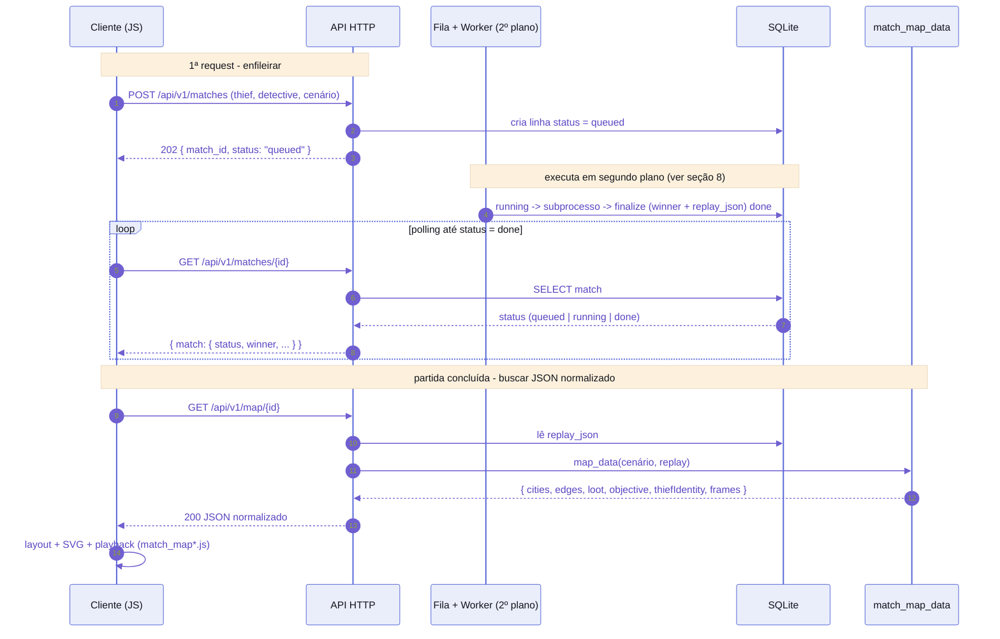

```mermaid
%%{init: {'theme':'base','themeVariables':{'primaryColor':'#eaeefb','primaryTextColor':'#12141c','primaryBorderColor':'#5566d6','lineColor':'#6f5fd0','signalColor':'#6f5fd0','signalTextColor':'#5a46c2','actorTextColor':'#12141c','noteBkgColor':'#fdf1dd','noteTextColor':'#12141c','fontSize':'12px'}}}%%
sequenceDiagram
    autonumber
    participant JS as Cliente (JS)
    participant API as API HTTP
    participant BG as Fila + Worker (2º plano)
    participant DB as SQLite
    participant MD as match_map_data

    Note over JS,API: 1ª request - enfileirar
    JS->>API: POST /api/v1/matches (thief, detective, cenário)
    API->>DB: cria linha status = queued
    API-->>JS: 202 { match_id, status: "queued" }

    Note over BG,DB: executa em segundo plano (ver seção 8)
    BG->>DB: running -> subprocesso -> finalize (winner + replay_json) done

    loop polling até status = done
        JS->>API: GET /api/v1/matches/{id}
        API->>DB: SELECT match
        DB-->>API: status (queued | running | done)
        API-->>JS: { match: { status, winner, ... } }
    end

    Note over JS,MD: partida concluída - buscar JSON normalizado
    JS->>API: GET /api/v1/map/{id}
    API->>DB: lê replay_json
    API->>MD: map_data(cenário, replay)
    MD-->>API: { cities, edges, loot, objective, thiefIdentity, frames }
    API-->>JS: 200 JSON normalizado
    JS->>JS: layout + SVG + playback (match_map*.js)
```
