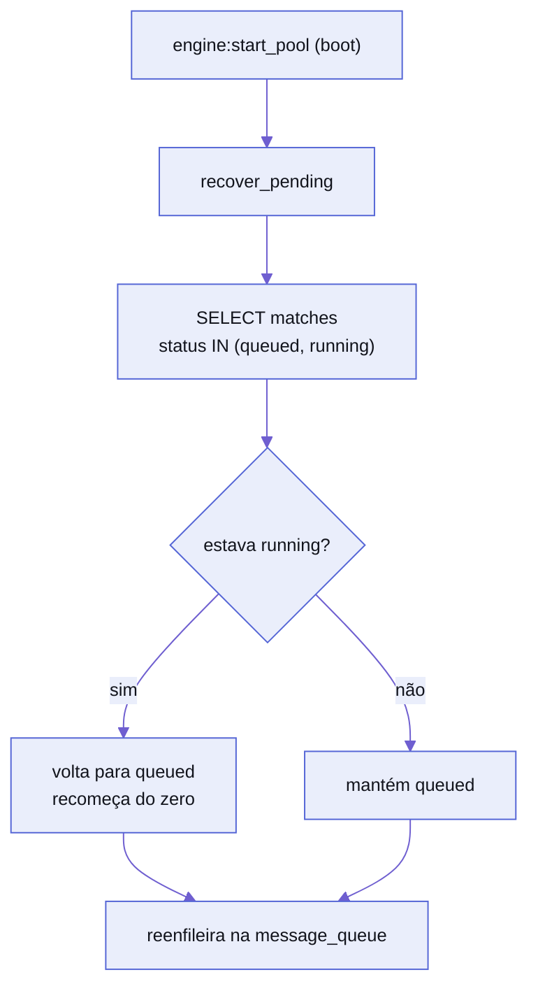

```mermaid
%%{init: {'theme':'base','themeVariables':{'primaryColor':'#eaeefb','primaryTextColor':'#12141c','primaryBorderColor':'#5566d6','lineColor':'#6f5fd0','edgeLabelBackground':'#eaeefb','fontSize':'13px'}}}%%
flowchart TD
    Boot["engine:start_pool (boot)"] --> Rec["recover_pending"]
    Rec --> Sel["SELECT matches<br/>status IN (queued, running)"]
    Sel --> Reset{"estava running?"}
    Reset -- sim --> Q1["volta para queued<br/>recomeça do zero"]
    Reset -- não --> Q2["mantém queued"]
    Q1 --> Send["reenfileira na message_queue"]
    Q2 --> Send
```
