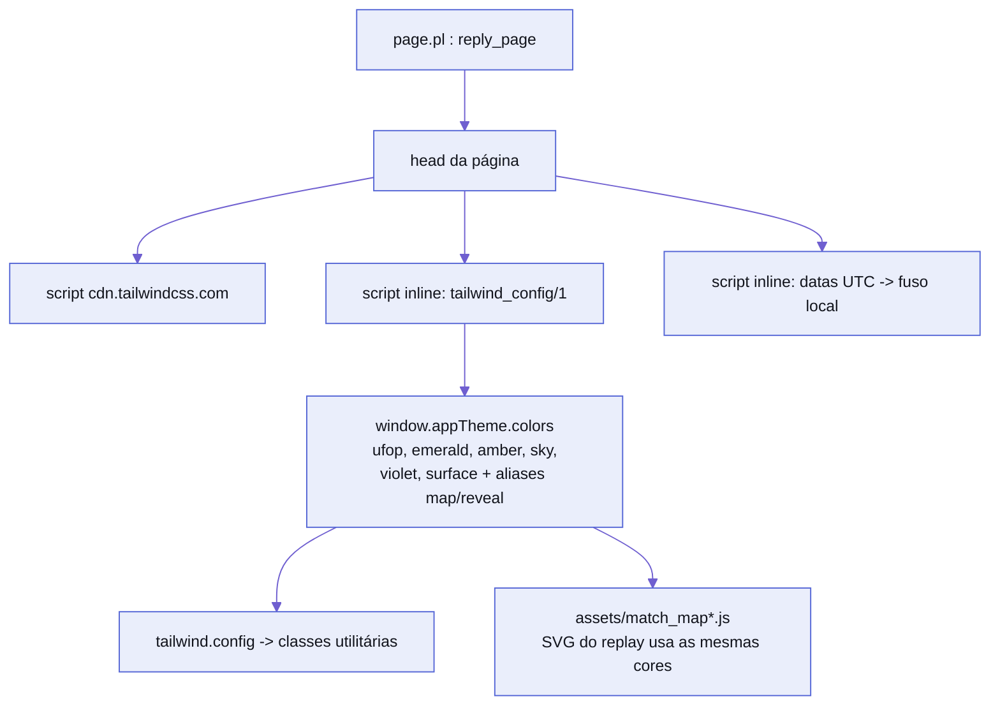

```mermaid
%%{init: {'theme':'base','themeVariables':{'primaryColor':'#eaeefb','primaryTextColor':'#12141c','primaryBorderColor':'#5566d6','lineColor':'#6f5fd0','edgeLabelBackground':'#eaeefb','fontSize':'13px'}}}%%
flowchart TD
    Page["page.pl : reply_page"] --> Head["head da página"]
    Head --> CDN["script cdn.tailwindcss.com"]
    Head --> Cfg["script inline: tailwind_config/1"]
    Head --> LT["script inline: datas UTC -> fuso local"]
    Cfg --> Theme["window.appTheme.colors<br/>ufop, emerald, amber, sky,<br/>violet, surface + aliases map/reveal"]
    Theme --> TW["tailwind.config -> classes utilitárias"]
    Theme --> JS["assets/match_map*.js<br/>SVG do replay usa as mesmas cores"]
```
