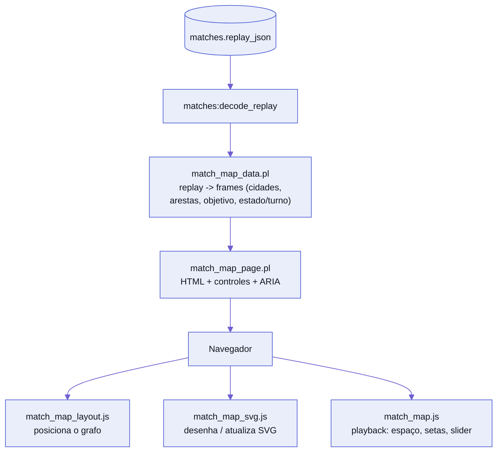

```mermaid
%%{init: {'theme':'base','themeVariables':{'primaryColor':'#eaeefb','primaryTextColor':'#12141c','primaryBorderColor':'#5566d6','lineColor':'#6f5fd0','edgeLabelBackground':'#eaeefb','fontSize':'13px'}}}%%
flowchart TD
    DB[("matches.replay_json")] --> Dec["matches:decode_replay"]
    Dec --> MD["match_map_data.pl<br/>replay -> frames (cidades,<br/>arestas, objetivo, estado/turno)"]
    MD --> MP["match_map_page.pl<br/>HTML + controles + ARIA"]
    MP --> Browser["Navegador"]
    Browser --> L["match_map_layout.js<br/>posiciona o grafo"]
    Browser --> Svg["match_map_svg.js<br/>desenha / atualiza SVG"]
    Browser --> Play["match_map.js<br/>playback: espaço, setas, slider"]
```
