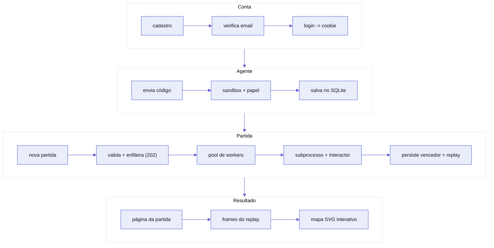

```mermaid
%%{init: {'theme':'base','themeVariables':{'primaryColor':'#eaeefb','primaryTextColor':'#12141c','primaryBorderColor':'#5566d6','lineColor':'#6f5fd0','fontSize':'13px'}}}%%
flowchart TD
    subgraph C["Conta"]
        direction LR
        Signup["cadastro"] --> Verify["verifica email"] --> Login["login -> cookie"]
    end
    subgraph A["Agente"]
        direction LR
        Upload["envia código"] --> Validate["sandbox + papel"] --> Store["salva no SQLite"]
    end
    subgraph P["Partida"]
        direction LR
        New["nova partida"] --> Enq["valida + enfileira (202)"] --> Pool["pool de workers"]
        Pool --> Sub["subprocesso + Interactor"] --> Persist["persiste vencedor + replay"]
    end
    subgraph R["Resultado"]
        direction LR
        Show["página da partida"] --> Frames["frames do replay"] --> Map["mapa SVG interativo"]
    end
    C --> A --> P --> R
```
